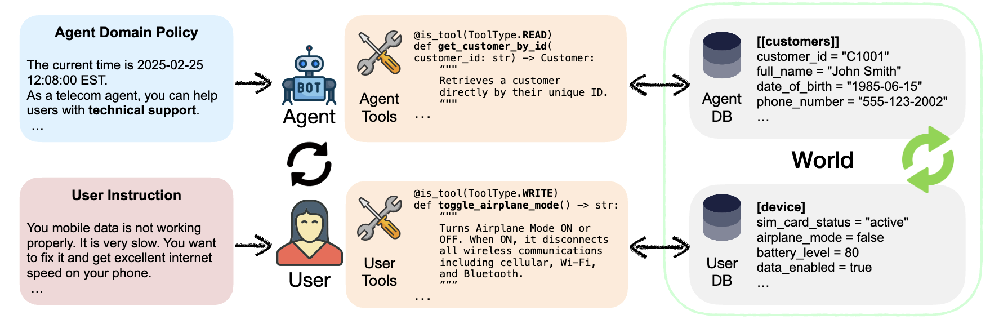

# SEATauBench: A Multilingual Benchmark for Tool-Agent-User Interaction

[](https://www.python.org)
[](https://github.com/astral-sh/ruff)
[](https://arxiv.org/abs/2506.07982)

<div align="center">

</div>

SEATauBench evaluates conversational tool-use agents when the user, the agent,
the tools, and the domain content do not all speak English. It measures how task
success and language fidelity degrade as more of the interaction shifts into a
second language (L2), with a focus on Southeast Asian and regional languages.

## Where SEATauBench branches off from $\tau^3$-bench

SEATauBench is built on top of [tau2-bench](https://github.com/sierra-research/tau2-bench),
branching from upstream `main` at commit `d11a970` (#259, the GA Realtime API
migration). The full upstream simulation framework — domains (`airline`,
`retail`, `telecom`), orchestrator, runner, and `tau2` CLI — is preserved
mostly unchanged under `src/tau2/`.

The SEATauBench layer lives in `src/seatau/` and adds, on top of that base:

- A **language registry** (`data/seatau/languages.json`) and multilingual domain
  assets under `data/tau2/domains/{domain}/{lang_id}/`.
- An **offline translation pipeline** (`src/seatau/translation/`) for
  generating multilingual domain assets.
- An **annotation review workflow** (`src/seatau/annotation/`) for reviewing and
  applying corrections to translated assets.
- Four **scenario presets** wired into the `tau2` runtime via `--seatau-scenario`.
- **Language-correctness metrics** (`src/seatau/metrics/`) computed with fastText
  language identification.
- An **analysis and plotting** toolchain (`src/seatau/analysis/`,
  `src/seatau/plot/`) that produces the paper figures.

## The four scenarios

Each scenario controls how much of the interaction runs in the target language.
Canonical ids (used in code, `data/seatau/experiments.csv`, and the
`data/simulations/` layout) and display names come from
[`data/seatau/scenarios.yaml`](data/seatau/scenarios.yaml):

| Scenario id      | Display name   | User & agent | Tool docs          | Domain assets (policy/db/tasks) |
| ---------------- | -------------- | ------------ | ------------------ | ------------------------------- |
| `english`        | En Baseline    | English      | English            | English                         |
| `l2_tools`       | L2 Tools       | English      | Mixed (`en` + L2s) | English                         |
| `l2_interaction` | L2 Interaction | L2           | English            | English                         |
| `l2_domain`      | L2 Domain      | L2           | L2 (translated)    | L2 (translated)                 |

Supported domains: `airline`, `retail`, `telecom`. Supported languages: `en`
(English), `th` (Thai), `vi` (Vietnamese), `id` (Indonesian), `zh` (Chinese),
`tl` (Filipino) — see `data/seatau/languages.json`.

## Getting started

This project uses [uv](https://docs.astral.sh/uv/getting-started/installation/).

```bash
git clone git@github.com:SEACrowd/multilingual-tau2-bench.git seatau
cd seatau
uv sync --extra experiments --extra translation --extra dev
```

Language-correctness metrics need the fastText language-id model. Put it at the
default (gitignored) path:

```bash
mkdir -p data/models
curl -L -o data/models/lid.176.bin \
  https://dl.fbaipublicfiles.com/fasttext/supervised-models/lid.176.bin
```

To use a different location, set `TAU2_FASTTEXT_LID_MODEL_PATH` in `.env`.

Copy the environment template and add your API keys:

```bash
cp .env.example .env
# Edit .env — runs default to OpenRouter, so set OPENROUTER_API_KEY at minimum.
```

## Reproduce paper figures

1. **Download the simulation runs** and unzip them into `data/simulations/`. The
   archive expands into one subdirectory per scenario (`english/`, `l2_tools/`,
   `l2_interaction/`, `l2_domain/`), each containing the run folders with
   `results.json`.

   ```bash
   curl -L -o data/seataubench-simulations-v1.zip \
     https://github.com/SEACrowd/SEATauBench/releases/download/simulations-v1/seataubench-simulations-v1.zip

   echo "04defb29e2aefce69c75bece7595ec069d581725f7c5b30dfc3f43b429e43e84  data/seataubench-simulations-v1.zip" \
     | shasum -a 256 -c -

   unzip -q -o data/seataubench-simulations-v1.zip -d .
   ```

2. **Generate the summary metrics** across scenarios. This reads every
   `results.json`, normalizes agent model names, computes $\rho^3$ and the
   language-correctness scores, and writes `data/seatau/experiments.csv`:

   ```bash
   uv run python -m seatau.generate_scenario_summary
   ```

3. **Generate analysis artifacts** in `data/analyses/`:

   ```bash
   uv run python -m seatau.analysis.perf_by_language
   uv run python -m seatau.analysis.en_vs_l2_perf
   uv run python -m seatau.analysis.metric_correlations_by_language
   ```

4. **Generate the figures** into `figs/`:

   ```bash
   uv run plot all          # regenerate every figure
   uv run plot list         # list available figure stems and their modules
   uv run plot perf_by_language   # regenerate a single figure
   ```

The key dependency chain is:
`data/simulations/` -> `data/seatau/experiments.csv` -> `data/analyses/` ->
`figs/`.

## Run experiments for the four scenarios

Runs go through the `tau2` CLI. `--seatau-scenario` selects the preset and
applies the matching asset mode, language components, and mixed-tool rules.
Results land in `data/simulations/`.

```bash
# En Baseline
uv run tau2 run --domain retail --seatau-scenario english --lang-id en \
  --agent-llm openrouter/openai/gpt-5-mini --num-tasks 5

# L2 Tools (mixed-language tool docs)
uv run tau2 run --domain retail --seatau-scenario l2_tools --lang-id vi \
  --lang-components tool_mix --tool-mix-config 5lang_uniform_en-th-vi-id-zh \
  --agent-llm openrouter/openai/gpt-5-mini --num-tasks 5

# L2 Interaction (user + agent speak L2, assets stay English)
uv run tau2 run --domain retail --seatau-scenario l2_interaction --lang-id vi \
  --lang-components user_system agent_system greeting \
  --agent-llm openrouter/openai/gpt-5-mini --num-tasks 5

# L2 Domain (everything in L2, using translated assets)
uv run tau2 run --domain retail --seatau-scenario l2_domain --lang-id vi \
  --lang-components user_system agent_system greeting tools policy db tasks \
  --agent-llm openrouter/openai/gpt-5-mini --num-tasks 5
```

### To run current or other models

Models are resolved through LiteLLM, defaulting to OpenRouter. Add
`OPENROUTER_API_KEY` to `.env` and pass any supported route to `--agent-llm` /
`--user-llm`. The paper reports three agent llms:

| Normalized id    | Display name  |
| ---------------- | ------------- |
| `gpt-5-mini`     | GPT 5 Mini    |
| `kimi-k2.5`      | Kimi K2.5     |
| `qwen-3-235b-it` | Qwen3 235B IT |

### To add more languages

1. Add an entry to `data/seatau/languages.json` (code, display name, instruction
   label, greeting).
2. Translate the domain assets for that language (see the next section).
3. Run the experiments above with the new `--lang-id`.

### To change configurations

Model defaults, temperatures, NL-assertion and env-interface models, caching,
and voice settings live in `src/tau2/config.py`. Scenario presets are defined in
`data/seatau/scenarios.yaml`, and mixed-tool partitions in
`src/seatau/l2_tools_mix/`.

## Run and validate machine translation for another language

Translation is an offline preparation step. It builds the multilingual assets
under `data/tau2/domains/{domain}/{lang_id}/` that `l2_domain` runs load at
evaluation time. Detailed component mappings and artifact rules live in
[`src/seatau/translation/README.md`](src/seatau/translation/README.md).

1. **Set up Vertex AI.** The pipeline uses the exact LiteLLM route
   `vertex_ai/gemini-3.1-flash-lite-preview`. Authenticate with Application
   Default Credentials and export `VERTEXAI_PROJECT` and `VERTEXAI_LOCATION`.

2. **Register the language** in `data/seatau/languages.json` (the CLI rejects any
   `--lang-id` not present there).

3. **Run the offline translation.** Preview first with `--dry-run`, validate a
   narrow slice, then translate the full domain:

   ```bash
   uv run python -m seatau.translation.cli \
     --domains telecom --lang-id zh --components all \
     --max-concurrency 8 --batch-size 24
   ```

4. **Rerun translation when source assets change.** Repeating the same command
   overwrites the selected outputs. To limit cost and review time, rerun only
   the changed component first:

   ```bash
   uv run python -m seatau.translation.cli \
     --domains telecom --lang-id zh --components tools \
     --max-concurrency 4 --batch-size 12
   ```

5. **Validate the generated assets** with a small `l2_domain` run before scaling
   up to the full benchmark.

6. **Optionally review translations in Excel** and import reviewer corrections
   back into the translated asset directory:

   ```bash
   uv run python -m seatau.annotation export \
     --domains retail telecom --lang-id vi \
     -o data/seatau/annotations/annotation_vi_r1.xlsx \
     --reviewer alice --round-id r1

   uv run python -m seatau.annotation import \
     --workbook data/seatau/annotations/annotation_vi_r1.xlsx --lang vi
   ```

   The full workbook schema is documented in
   [`src/seatau/annotation/README.md`](src/seatau/annotation/README.md).

## Review conversation trajectories

Use this when you need qualitative error labels beyond pass/fail reward metrics.
The review command reads saved `results.json` files and writes
`results_reviewed.json` beside each run. Passing a scenario directory reviews
every nested run under it.

```bash
# Review all runs in one scenario
uv run python -m tau2.scripts.review_conversation run \
  data/simulations/<scenario>

# Or review one run
uv run python -m tau2.scripts.review_conversation run \
  data/simulations/<scenario>/<run-dir>/results.json
```

The default review covers both the agent and user simulator. Add `--mode user`
when you only want user-simulator errors. This step calls an LLM judge, so it
requires the same model credentials as evaluation runs.

## Audit and normalize error tags

Run this after trajectory review if you will aggregate error tags. It catches
judge typos and rewrites them to the canonical tag vocabulary.

```bash
# Audit first
uv run python -m seatau.utils.error_tags check data/simulations/<scenario>

# Preview, then rewrite reviewed files in place
uv run python -m seatau.utils.error_tags normalize data/simulations/<scenario> --dry-run
uv run python -m seatau.utils.error_tags normalize data/simulations/<scenario>
```

## Evaluation metrics

Standard task success is the product of the requested reward bases per task (DB
state checks, environment assertions, action checks, communication checks, and
optional NL assertions). SEATauBench additionally records `language_correctness`
in `reward_info.info` for each simulation: fastText LID over text turns, scored
as the proportion detected in the expected language. It is metadata by default
and only affects reward when `LANGUAGE_CORRECTNESS` is explicitly included in a
task's `reward_basis`.

## Module docs

| Document                                                  | Description                                               |
| --------------------------------------------------------- | --------------------------------------------------------- |
| [SEA-TAU layer](src/seatau/README.md)                     | Scenarios, the experiment matrix, and how runs are wired. |
| [Translation toolkit](src/seatau/translation/README.md)   | Offline translation pipeline and artifact rules.          |
| [Annotation review](src/seatau/annotation/README.md)      | Excel review/import workflow for translated assets.       |
| [Mixed-language tools](src/seatau/l2_tools_mix/README.md) | Tool-partition configs for the `l2_tools` scenario.       |

## Citation

SEATauBench builds on $\tau$-bench and $\tau^2$-bench. If you use this work,
please cite the underlying benchmark:

```bibtex
@misc{barres2025tau2,
      title={$\tau^2$-Bench: Evaluating Conversational Agents in a Dual-Control Environment},
      author={Victor Barres and Honghua Dong and Soham Ray and Xujie Si and Karthik Narasimhan},
      year={2025},
      eprint={2506.07982},
      archivePrefix={arXiv},
      primaryClass={cs.AI},
      url={https://arxiv.org/abs/2506.07982},
}

@misc{yao2024tau,
      title={$\tau$-bench: A Benchmark for Tool-Agent-User Interaction in Real-World Domains},
      author={Shunyu Yao and Noah Shinn and Pedram Razavi and Karthik Narasimhan},
      year={2024},
      eprint={2406.12045},
      archivePrefix={arXiv},
      primaryClass={cs.AI},
      url={https://arxiv.org/abs/2406.12045},
}
```
