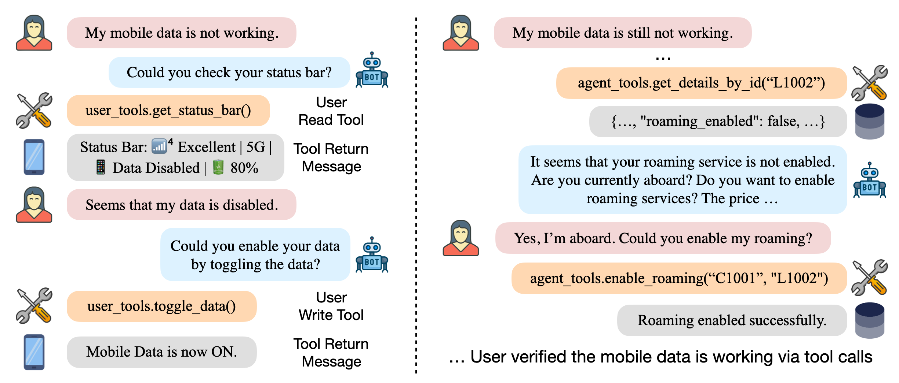

# SEA-Tau Bench: A Benchmark for Tool-Agent-User Interaction in Real-World Domains

[](https://www.python.org)
[](https://github.com/astral-sh/ruff)
[](https://arxiv.org/abs/2506.07982)
[](https://sierra.ai/blog/benchmarking-agents-in-collaborative-real-world-scenarios)
[](https://x.com/SierraPlatform/status/1932464265207889974)
[](https://www.linkedin.com/posts/sierra_last-year-we-introduced-%F0%9D%9C%8F-bench-a-benchmark-activity-7338229693898231809-F8L4?utm_source=share&utm_medium=member_desktop&rcm=ACoAAAdc8goBmhEsiEo1_t_XSJbAnY4_zMfAWcE)
[](https://taubench.com)

<div align="center">

</div>

<div align="center">
<h3>🚀 τ³-bench is here!</h3>
<p>From text-only to multimodal, knowledge-aware agent evaluation.<br>
Voice full-duplex · Knowledge retrieval · 75+ task fixes<br>
<a href="https://arxiv.org/abs/2603.13686">τ-Voice paper</a> · <a href="https://arxiv.org/abs/2603.04370">τ-Knowledge paper</a> · <a href="https://arxiv.org/abs/2512.07850">Task fixes paper</a> · <a href="https://github.com/sierra-research/tau2-bench/releases/tag/v1.0.0">Release notes</a></p>
</div>

> **How do you say $\tau^3$-bench?** We just say "tau three," but you do you!

## What's New in $\tau^3$-bench

- **Knowledge Domain (`banking_knowledge`)** — A knowledge-retrieval-based customer service domain with configurable RAG pipelines, document search, embeddings, and agentic shell-based search. [Learn more →](src/tau2/knowledge/README.md)
- **Voice Full-Duplex (Audio Native)** — End-to-end voice evaluation with realtime providers (OpenAI, Gemini, xAI). [Learn more →](src/tau2/voice/README.md)
- **Task Quality (75+ fixes)** — Removed incorrect expected actions, clarified ambiguous instructions, fixed impossible constraints, and added missing fallback behaviors across airline, retail, and banking domains. Based on analysis from [SABER](https://arxiv.org/abs/2512.07850) (Cuadron et al., 2025). [Learn more →](https://taubench.com/blog/tau3-task-fixes.html)
- **Updated Leaderboard** — Now includes voice and knowledge results. Compare model performance at [taubench.com](https://taubench.com). [Submit your results →](docs/leaderboard-submission.md)

See [CHANGELOG.md](CHANGELOG.md) for the full version history.

> **Backward compatibility note**: If you are evaluating an agent (not training), use the `base` task split to evaluate on the complete task set that matches the original τ-bench structure. This is the default.

> **Upgrading from $\tau^2$-bench?** Installation now uses `uv` instead of `pip install -e .`, and Python `>=3.12, <3.14` is required (was `>=3.10`). Some internal APIs have been refactored — see [CHANGELOG.md](CHANGELOG.md) for details.

## Overview

$\tau$-bench is a simulation framework for evaluating customer service agents across multiple domains. It supports text-based half-duplex (turn-based) evaluation and voice full-duplex (simultaneous) evaluation using real-time audio APIs.

Each domain specifies:

- A **policy** that the agent must follow
- A set of **tools** that the agent can use
- A set of **tasks** to evaluate the agent's performance
- Optionally: a set of **user tools** for the user simulator

**Available domains**: `mock` · `airline` · `retail` · `telecom` · `banking_knowledge`

| Mode                    | Description                                                   |
| ----------------------- | ------------------------------------------------------------- |
| **Text (half-duplex)**  | Turn-based chat with tool use                                 |
| **Voice (full-duplex)** | End-to-end audio via realtime providers (OpenAI, Gemini, xAI) |

## Quick Start

### 1. Install

```bash
git clone https://github.com/sierra-research/tau2-bench
cd tau2-bench
uv sync --extra experiments --extra dev  # project deps + experiments/dev
```

Optional extras (install what you need):

```bash
uv sync --extra voice          # + voice/audio-native features
uv sync --extra knowledge      # + banking_knowledge domain (retrieval pipeline)
uv sync --extra gym            # + gymnasium RL interface
uv sync --extra dev            # + pytest, ruff, pre-commit (required for contributing)
uv sync --extra experiments    # + plotting libs and fasttext for src/experiments/
uv sync --all-extras           # everything
```

This requires [uv](https://docs.astral.sh/uv/getting-started/installation/). Voice features also need system dependencies (`brew install portaudio ffmpeg` on macOS). See the [full installation guide](docs/getting-started.md) for details.

SEA-TAU language-correctness metrics use the fastText language identification
model. Put the official model at the default gitignored path:

```bash
mkdir -p data/models
curl -L -o data/models/lid.176.bin \
  https://dl.fbaipublicfiles.com/fasttext/supervised-models/lid.176.bin
```

The model is large and should stay out of git. To use another location, set
`TAU2_FASTTEXT_LID_MODEL_PATH` in `.env`.

### 2. Set up API keys

```bash
cp .env.example .env
# Edit .env with your API keys (uses LiteLLM — any supported provider works)
```

### 3. Run an evaluation

```bash
tau2 run --domain airline --agent-llm gpt-4.1 --user-llm gpt-4.1 \
  --num-trials 1 --num-tasks 5
```

Results are saved to `data/simulations/`. Use `tau2 view` to browse them.

> **Tip**: Run `tau2 intro` for an overview of available domains, commands, and examples.

#### OpenRouter cost tracking

If you use OpenRouter, `src/utils/openrouter_cost.py` can print a balance snapshot
or track usage before and after a run. Set `OPENROUTER_API_KEY` in your environment
first.

Print the current key limits / usage snapshot

```sh
uv run src/utils/openrouter_cost.py
```

Track cost around a τ-bench run

```sh
TAU2_TRACK_OPENROUTER_COST=1 uv run tau2 run --domain airline \
 --agent-llm gpt-4.1 --user-llm gpt-4.1 --num-trials 1 --num-tasks 1
```

When tracking is enabled, the helper prints `before`, `after`, and `delta` records
for the process it wraps.

#### Multilingual evaluation

Available languages: `en` (English), `th` (Thai), `vi` (Vietnamese), `id` (Indonesian), `zh` (Chinese), `tl` (Filipino). Add more in [config/languages.json](./config/languages.json).

**Use `scripts/run_seatau.sh`** for SEA-TAU presets. Preset definitions and config semantics are documented in [`config/sea-tau/README.md`](./config/sea-tau/README.md).

| Preset         | EXP # | User conversation | Agent conversation | Tool language               | Context (`db/tasks/policy`) | Notes                                                                                                   |
| -------------- | ----- | ----------------- | ------------------ | --------------------------- | --------------------------- | ------------------------------------------------------------------------------------------------------- |
| `mixed_tools`  | 1     | English           | English            | Mixed (`en` + selected L2s) | English                     | Uses `mixed_tools`; default config `5lang_uniform_en-th-vi-id-zh`; override with `--mixed-tools-config` |
| `crosslingual` | 2     | L2                | L2                 | English                     | English                     | Uses `user_system agent_system greeting`                                                                |
| `translated`   | 3     | L2                | L2                 | L2                          | L2                          | Uses all runtime language components                                                                    |
| `localized`    | 4     | L2                | L2                 | L2                          | L2                          | Same runtime wiring as translated, but human-localized assets                                           |
| `baseline`     | –     | English           | English            | English                     | English                     | No language components                                                                                  |

```bash
# One experiment, one language
scripts/run_seatau.sh --experiment crosslingual \
  --domain retail --lang-id vi --agent-llm gpt-4.1 --user-llm gpt-4.1 --num-tasks 5

# All 4 experiments in one invocation (mixed_tools/crosslingual/translated/localized)
scripts/run_seatau.sh --all-experiments \
  --domain retail --lang-id vi --agent-llm gpt-4.1 --user-llm gpt-4.1 --num-tasks 5

# Omit --lang-id to fan out across every language in config/languages.json
scripts/run_seatau.sh --experiment translated \
  --domain retail --agent-llm gpt-4.1 --user-llm gpt-4.1 --num-tasks 5

# Preview commands without executing
scripts/run_seatau.sh --all-experiments --dry-run \
  --domain retail --lang-id vi --agent-llm gpt-4.1 --user-llm gpt-4.1 --num-tasks 5

# Pick a specific mixed-tools partition config
scripts/run_seatau.sh --experiment mixed_tools --mixed-tools-config 2lang_uniform_en-th \
  --domain retail --lang-id th --agent-llm gpt-4.1 --user-llm gpt-4.1 --num-tasks 5
```

**Run `tau2` directly** for ad-hoc multilingual evals:

```bash
# Full multilingual bundle (all components, Vietnamese)
tau2 run --domain retail --lang-id vi --agent-llm gpt-4.1 --user-llm gpt-4.1 \
  --num-trials 1 --num-tasks 5

# Cross-lingual: user + agent speak Vietnamese, assets stay in English
tau2 run --domain retail --lang-id vi \
  --lang-components user_system agent_system greeting \
  --agent-llm gpt-4.1 --user-llm gpt-4.1 --num-trials 1 --num-tasks 5
```

#### Evaluation metrics

Standard task success is the product of the requested reward bases in each task:
DB state checks, environment assertions, action checks, communication checks, and
optional NL assertions. SEA-TAU additionally records `language_correctness` in
`reward_info.info` for each simulation. This metric uses fastText LID over
assistant text turns and reports the proportion detected in the expected
language. It is metadata by default; it affects the final reward only when
`LANGUAGE_CORRECTNESS` is explicitly included in a task `reward_basis` or when
`EvaluationType.LANGUAGE_CORRECTNESS` is used.

## Documentation

### Getting Started

| Document                                   | Description                                                        |
| ------------------------------------------ | ------------------------------------------------------------------ |
| [Getting Started](docs/getting-started.md) | Installation, API keys, first run, output structure, configuration |
| [CLI Reference](docs/cli-reference.md)     | All `tau2` commands and options                                    |

### Core Concepts

| Document                                                              | Description                                          |
| --------------------------------------------------------------------- | ---------------------------------------------------- |
| [Agent Developer Guide](src/tau2/agent/README.md)                     | Build and evaluate your own agent                    |
| [Domains](src/tau2/domains/README.md)                                 | Domain structure, data format, and available domains |
| [Orchestrator & Communication Modes](src/tau2/orchestrator/README.md) | Half-duplex and full-duplex orchestration            |

### Specialized Module Docs

| Document                                                        | Description                                                         |
| --------------------------------------------------------------- | ------------------------------------------------------------------- |
| [Runner Architecture](src/tau2/runner/README.md)                | Build/run layers, checkpointing, retries, and batch execution.      |
| [Voice Full-Duplex](src/tau2/voice/README.md)                   | Voice mode setup, providers, output layout, and runtime options.    |
| [Audio-Native Providers](src/tau2/voice/audio_native/README.md) | Provider adapter architecture and extension points.                 |
| [Knowledge Retrieval](src/tau2/knowledge/README.md)             | `banking_knowledge` retrieval configs and requirements.             |
| [Translation Toolkit](src/translation/README.md)                | Translation pipeline, artifacts, and multilingual generation rules. |
| [Experiments Index](src/experiments/README.md)                  | Experimental modules and links to experiment-specific docs.         |
| [Config Reference](config/README.md)                            | Language registry and SEA-TAU config files.                         |
| [SEA-TAU Config](config/sea-tau/README.md)                      | Canonical SEA-TAU preset behavior matrix and settings.              |
| [Leaderboard Web App](web/leaderboard/README.md)                | Local leaderboard UI development and submission data flow.          |

## Citation

If you use a specific component of $\tau^3$-bench, please cite the corresponding paper below.

### Knowledge Domain (`banking_knowledge`)

```bibtex
@article{shi2026tau,
  title={$\tau$-Knowledge: Evaluating Conversational Agents over Unstructured Knowledge},
  author={Shi, Quan and Zytek, Alexandra and Razavi, Pedram and Narasimhan, Karthik and Barres, Victor},
  journal={arXiv preprint arXiv:2603.04370},
  year={2026}
}
```

### Voice Full-Duplex Benchmark

```bibtex

@misc{ray2026tauvoicebenchmarkingfullduplexvoice,
      title={$\tau$-Voice: Benchmarking Full-Duplex Voice Agents on Real-World Domains},
      author={Soham Ray and Keshav Dhandhania and Victor Barres and Karthik Narasimhan},
      year={2026},
      eprint={2603.13686},
      archivePrefix={arXiv},
      primaryClass={cs.SD},
      url={https://arxiv.org/abs/2603.13686},
}
```

### Core $\tau$-Bench

```bibtex

@misc{barres2025tau2,
      title={$\tau^2$-Bench: Evaluating Conversational Agents in a Dual-Control Environment},
      author={Victor Barres and Honghua Dong and Soham Ray and Xujie Si and Karthik Narasimhan},
      year={2025},
      eprint={2506.07982},
      archivePrefix={arXiv},
      primaryClass={cs.AI},
      url={https://arxiv.org/abs/2506.07982},
}

@misc{yao2024tau,
      title={$\tau$-bench: A Benchmark for Tool-Agent-User Interaction in Real-World Domains},
      author={Shunyu Yao and Noah Shinn and Pedram Razavi and Karthik Narasimhan},
      year={2024},
      eprint={2406.12045},
      archivePrefix={arXiv},
      primaryClass={cs.AI},
      url={https://arxiv.org/abs/2406.12045},
}
```

### Task Fixes

```bibtex

@inproceedings{cuadron2026saber,
      title={{SABER}: Small Actions, Big Errors {\textemdash} Safeguarding Mutating Steps in {LLM} Agents},
      author={Alejandro Cuadron and Pengfei Yu and Yang Liu and Arpit Gupta},
      booktitle={ICLR 2026 Workshop on Memory for LLM-Based Agentic Systems},
      year={2026},
      url={https://openreview.net/forum?id=En2z9dckgP},
}
```
