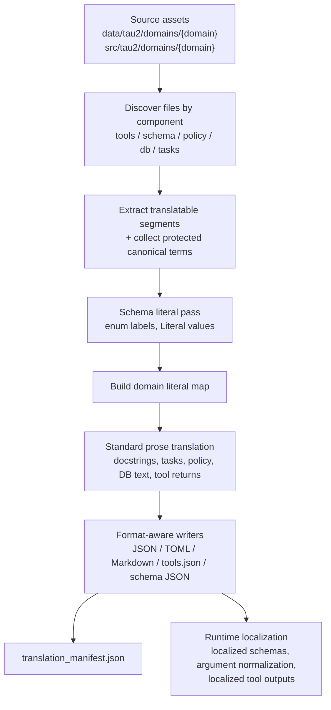

# Tau2 Translation Toolkit

This module builds multilingual Tau2 domain assets that can be loaded at runtime
with `--lang-id`. It translates the agent-facing surface of a domain while
preserving the canonical English values that the execution layer expects.

## What the CLI produces

For a domain-language pair such as `retail` + `th`, the pipeline writes a
language subdirectory under:

`data/tau2/domains/{domain}/{lang_id}/`

The exact outputs depend on the domain and selected components:

- `tools.json`: translated docstrings extracted from `tools.py`
- `user_tools.json`: translated docstrings extracted from `user_tools.py`
- `data_model.json`: translated schema artifact derived from `data_model.py`
- `user_data_model.json`: translated schema artifact derived from `user_data_model.py`
- `tasks.json`: translated task definitions
- `*.md`: translated policy and workflow documents
- `db.json` / `db.toml`: translated database artifacts with structure preserved
- `user_db.json` / `user_db.toml`: translated user-side database artifacts
- `tool_returns.json`: translated exact strings and output templates for runtime
  tool responses
- `translation_manifest.json`: per-output provenance metadata and source
  fingerprints

Telecom currently exercises the broadest surface, including `user_tools.json`,
`user_data_model.json`, `user_db.toml`, and `tool_returns.json`.

## Pipeline at a glance



## Source roots and component mapping

The CLI reads from two roots:

- `data/tau2/domains/{domain}/`: task files, policy markdown, DB files
- `src/tau2/domains/{domain}/`: tool docstrings, schema definitions, telecom
  tool return templates

Supported components:

| Component | Source artifacts |
| --- | --- |
| `tools` | `tools.py`, `user_tools.py`, `tool_returns.json` |
| `schema` | `data_model.py`, `user_data_model.py` |
| `policy` | `*.md` |
| `db` | `db.json`, `db.toml`, `user_db.json`, `user_db.toml` |
| `tasks` | `tasks*.json` except explicitly skipped variants |
| `context` | Alias for `policy`, `db`, `tasks` |
| `all` | All supported components |

## Language registry

The accepted `--lang-id` values come from:

`src/seatau/languages.json`

The CLI resolves the target language display name from that registry and uses it
in the translation prompt.

## CLI usage

```bash
uv run python -m seatau.translation.cli \
  --domains DOMAIN \
  --lang-id CODE \
  [--domains DOMAIN2 ...] \
  [--source-language English] \
  [--components tools|schema|policy|db|tasks|context|all ...] \
  [--data-domains-root data/tau2/domains] \
  [--src-domains-root src/tau2/domains] \
  [--model vertex_ai/gemini-3.1-flash-lite-preview] \
  [--max-concurrency 8] \
  [--batch-size 24] \
  [--timeout 120] \
  [--retries 3] \
  [--dry-run] \
  [--max-preview 20]
```

### Important CLI behavior

1. `--domains` is repeatable and required.
2. `--lang-id` must exist in `src/seatau/languages.json`.
3. `--components` is repeatable. The CLI normalizes aliases into the canonical
   processing order `tools -> schema -> policy -> db -> tasks`.
4. The pipeline currently enforces the exact LiteLLM route
   `vertex_ai/gemini-3.1-flash-lite-preview`. Alternate provider aliases or
   Gemini spellings are rejected.
5. Unsupported domains are blocked by
   `SKIPPED_TRANSLATION_DOMAINS = {"banking_knowledge", "mock"}`.
6. `--dry-run` previews extracted segments, but the current implementation still
   validates the Vertex environment before extraction. In practice, you still
   need `google.auth`, Application Default Credentials, `VERTEXAI_PROJECT`, and
   `VERTEXAI_LOCATION`.

## Recommended workflow

### 1. Inspect the extractable surface

```bash
uv run python -m seatau.translation.cli \
  --domains telecom \
  --lang-id zh \
  --components all \
  --dry-run \
  --max-preview 20
```

Use this to verify that the selected component set resolves to the files and
segment types you expect.

### 2. Translate a narrow slice first

```bash
uv run python -m seatau.translation.cli \
  --domains retail \
  --lang-id th \
  --components tools schema \
  --max-concurrency 2 \
  --batch-size 8
```

This is the fastest way to validate credentials, prompt behavior, and output
structure before translating large task corpora.

### 3. Run a full domain translation

```bash
uv run python -m seatau.translation.cli \
  --domains telecom \
  --lang-id zh \
  --components all \
  --max-concurrency 8 \
  --batch-size 24
```

### 4. Translate multiple domains in one run

```bash
uv run python -m seatau.translation.cli \
  --domains airline \
  --domains retail \
  --lang-id vi \
  --components context
```

### 5. Rebuild only policy and DB assets

```bash
uv run python -m seatau.translation.cli \
  --domains airline \
  --lang-id id \
  --components policy \
  --components db
```

## Technical details

### 1. File discovery

`discover_domain_files(...)` resolves domain files from the selected roots and
components. Notable filtering rules:

- task globs are `tasks*.json`
- task variants such as `tasks_voice.json` and domain-specific excluded files
  are skipped
- telecom source-side `tool_returns.json` is treated as part of `tools`
- Python files are split into tool files and schema files

### 2. Extraction strategy

Each file is converted into typed translation segments:

- Markdown: one segment per document
- Tasks JSON: only allowlisted natural-language paths are translated
- DB JSON/TOML: only conservative leaf keys are translated, such as `name`,
  `title`, `description`, `summary`, and `notes`
- Tool Python: only docstrings of `@is_tool` / `@is_discoverable_tool` methods
  are extracted
- Tool docstrings: Google-style docstrings are split into short description,
  long description, parameter descriptions, returns, and raises blocks
- Schema Python: class descriptions, field descriptions, enum values, and
  `Literal[...]` values are extracted into schema artifacts
- Tool return templates: both exact response strings and parameterized
  templates are extracted

### 3. Protection of runtime-canonical strings

The pipeline collects strings that must survive translation unchanged:

- IDs such as `task_*`, `order_*`, `booking_*`, `flight_*`
- status values and other fixed runtime literals
- tool/function names and tool-call names found in structured data
- task-only markers such as `DB`, `ACTION`, `ENV_ASSERTION`, `NL_ASSERTION`
- Google-style docstring headers such as `Args`, `Returns`, and `Raises`

These are masked as placeholders before translation and restored afterward.

### 4. Two translation modes

The pipeline runs two logically distinct passes:

1. Literal pass:
   translates schema enum labels and `Literal[...]` values in isolation to
   settle the localized terminology first.
2. Standard pass:
   translates everything else, while injecting the schema-derived literal map so
   that prose uses the same localized forms consistently.

This is the main mechanism that keeps schema labels, docstrings, tasks, and
tool outputs aligned.

### 5. Batching, deduplication, and recovery

- requests are grouped into JSON batches of `{"id", "text"}`
- identical masked telecom task segments are deduplicated aggressively
- batches run concurrently with a thread pool
- failed batches can be retried and recursively split
- placeholder-loss failures fall back to per-request retries, then to retries on
  localized source text

### 6. Format-aware writers

The output writer preserves the container format:

- Markdown is written directly
- JSON and TOML are patched only at extracted paths
- tool docstrings are reassembled into complete docstrings and written as
  `tools.json` / `user_tools.json`
- schema artifacts are written as `data_model.json` /
  `user_data_model.json`
- DB files with zero translated leaves are still copied through so the language
  directory remains complete

### 7. Reproducibility metadata

Every language directory receives `translation_manifest.json`. For each output
file it records:

- component type
- output filename
- translation model
- source and target language labels
- translation timestamp
- one or more source files with SHA-256 fingerprints

At runtime, loader utilities can warn when translated assets are missing or when
source fingerprints have gone stale.

## Runtime use

The translation CLI is only the offline half of the system. At evaluation time,
the runtime localization layer uses the schema artifacts to:

- localize tool schema descriptions and enum choices shown to the agent
- normalize localized tool arguments back to canonical English values
- localize structured tool response payloads back into the target language
- canonicalize payloads before metric comparison

This is why the offline outputs include both prose artifacts and schema
artifacts.

## Common commands

### Translate tools only

```bash
uv run python -m seatau.translation.cli \
  --domains retail \
  --lang-id th \
  --components tools
```

### Translate context only

```bash
uv run python -m seatau.translation.cli \
  --domains retail \
  --lang-id th \
  --components context
```

### Translate everything

```bash
uv run python -m seatau.translation.cli \
  --domains retail \
  --lang-id zh \
  --components all
```

## Troubleshooting

- `DefaultCredentialsError` or missing Google auth packages
  - Run `uv sync`, authenticate with gcloud / ADC, and export
    `VERTEXAI_PROJECT` plus `VERTEXAI_LOCATION`.
- `Missing Vertex AI environment variable(s)`
  - Set `VERTEXAI_PROJECT` and `VERTEXAI_LOCATION`.
- `Translation must use the Vertex AI route ...`
  - Use the exact default model string
    `vertex_ai/gemini-3.1-flash-lite-preview`.
- Quota or timeout failures
  - Lower throughput, for example:
    `--max-concurrency 2 --batch-size 8 --timeout 180`.
- Output exists but is stale
  - Re-run translation for that language so `translation_manifest.json` matches
    current source fingerprints.
